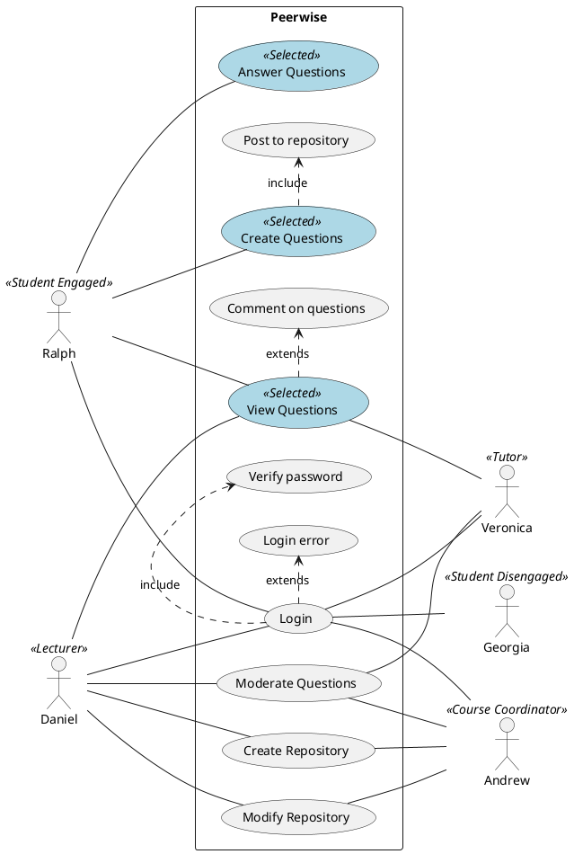

# SWEN303 Assignment 2 - Designs

__Ahad Rahman (300433299)__

__George Dorrington (300429785)__

*Assignment Mark Weighting*
* Update = 0%
* Design Coverage = 40%
* Design Quality = 40%
* Reflection = 20%

## Part 1: Introduction __NOT UPDATED__
### Description
#### Existing Solution
Peerwise is an online learning tool created by Auckland University. It is used in addition to classes and tutorials to help further a student’s understanding of specific course content with minimal lecturer input.
At the start of the college term or university trimester, an empty repository is created by the course coordinator. Students can then create questions, answer questions, rate questions and further discuss them.
Peerwise has received a lot of positive user feedback, specifically relating to the opportunity to interact and engage with course material. However, on the flip side, users describe the UI as underwhelming and because of the lacklustre appearance, they can become disengaged with the course content.

#### Business Objectives
Peerwise should allow the course coordinator to create empty repositories where students on the same course can contribute as a group. It is important that the process of grouping students is easy and intuitive as the program should have little to no staff input as it is designed to be predominately student self-generative.
Students who have access to Peerwise should be able to; post questions, read other student’s questions and have general discussions about answers. However, moderation is required by the lecturer and course coordinator within the repositories to ensure discussions are on-topic and answers are directionally correct.

#### Main objectives of Peerwise:
1. Enable students to clarify their understanding and support their learning
2. Engage students with course content during trimesters
3. Student self-generative

#### Alternatives to Peerwise:
__GoSoapBox__

* Pros: Designed in a way that is easy to gauge students understanding of course content, answers are updated in real time
* Cons: The UI design is outdated, and answers and questions cannot be easily moderated
* Overall: GoSoapBox is a good informal assessment tool which allows student outside the classroom to engage with content

__Kahoot__

* Pros: Simple way for students to engage in practice for assessments
* Cons: Tracking individual students results is difficult due to the fun 'nickname' feature
* Overall: Easy to set up, very engaging due to fun nature but can distract from learning

#### Importance to Stakeholders
The purpose of Peerwise is to assist student’s understanding and learning on specific topics and provides the backbone for distance students to contribute to a class discussion. Due to the wide range of stakeholders it is important that Peerwise works on a variety of devices and browsers.

It is also important to recognise that because Peerwise is self-generative, the resource becomes ineffective if there isn’t a large number of users engaging with and contributing to content. Analytics which provide insight on who is using Peerwise, the numbers and types of questions and discussion replies is also important to stakeholders.

We ordered our personas based on their intended use of Peerwise and the importance placed on the activities they do. This can be reflected in the table below: 

| Stakeholder        | Involvement with system                                                                                     |
|--------------------|-------------------------------------------------------------------------------------------------------------|
| Student Engaged    | Creates questions, answers questions and prompts discussion                                                 |
| Tutor              | Overviews questions in the repository they tutor and if answers are incorrect posts in the discussion forum |
| Lecturer           | Overviews questions from different repositories and if answers are incorrect posts in the discussion forum  |
| Student Disengaged | Views content but doesn’t interact with it                                                                  |
| Course Coordinator | Groups users into course repositories and views analytics 

## Part 2: Personas and Requirements __NOT UPDATED__

### Model Overview
```
@startuml
left to right direction
skinparam packageStyle rectangle
skinparam usecase {
	BackgroundColor<< Selected >> LightBlue
	BorderColor<< Selected >> Black
}

actor Ralph <<Student Engaged>>
actor Georgia <<Student Disengaged>>
actor Daniel <<Lecturer>>
actor Andrew <<Course Coordinator>>
actor Veronica <<Tutor>>

rectangle Peerwise{

   (View Questions) << Selected >>
   (Create Questions) << Selected >>
   (Answer Questions) << Selected >>

   Ralph -- (Login) 
   Ralph -- (View Questions)
   Ralph -- (Create Questions)
   Ralph -- (Answer Questions) 

   (Create Questions) .> (Post to repository) : include
   (View Questions) .> (Comment on questions) : extends 
   (Login) .> (Verify password) : include
   (Login) .> (Login error) : extends   

   Daniel -- (Login)
   Daniel -- (Create Repository) 
   Daniel -- (View Questions)
   Daniel -- (Moderate Questions)
   Daniel -- (Modify Repository) 

   (Login) -- Andrew
   (Create Repository) -- Andrew
   (Moderate Questions) -- Andrew
   (Modify Repository) -- Andrew

   (Login) -- Georgia

   (Login) -- Veronica
   (View Questions) -- Veronica
   (Moderate Questions) -- Veronica
   
}
@enduml
```

Our planning and drafts for the above Use-Case Diagram is shown below:
* [Initial Sketch](https://gitlab.ecs.vuw.ac.nz/rahmanahad/swen303-assignment-1/blob/master/Resources/whiteboard_planning1.png)
* [Revision 1](https://gitlab.ecs.vuw.ac.nz/rahmanahad/swen303-assignment-1/blob/master/Resources/whiteboard_planning2.png)
* [Revision 2](https://gitlab.ecs.vuw.ac.nz/rahmanahad/swen303-assignment-1/blob/master/Resources/whiteboard_planning3.png)

#### Discussion
To create the persona model, we used behavioural generation techniques. This means for each persona, we broke it up into their behavioural variables:
* Activities (what they do)
* Attitudes (how they think)
* Aptitudes (naturally good at)
* Motivations (what they want)
* Skills (thing they are good at)
* Weaknesses (things that are not good at)
* Technology Capability (experience with technology)
* System Knowledge (experience with Peerwise)
* Peerwise Expected Use (usage prediction)

We started our persona generation by thinking about the different types of people involved in a typical university course. The obvious ones were students and lecturers. After deeper thinking, we added course coordinator and tutor, as they are also crucial stakeholders to the success of a course. From our own experiences, we find that some students are more engaged than others. Thus, leading us to decide that since students are a significantly larger group than the other ones, they should be split up into student engaged and student disengaged.

The personas outlined below have a mix of technological capabilities, enthusiasm to learn, and each with their own unique traits that make them real.

To create the initial use cases, we did some informal whiteboard planning to understand how the different types of users would interact with the system. Since we did not have a Peerwise account at the start, most of these were use cases that we would want to see in a student collaboration learning tool.

To prioritize our use cases, we sat down and thought about what Peerwise’s initial vision was. The purpose of Peerwise is to help further a student’s understanding of specific course content with minimal lecturer input. This means students collaborate themselves and do the learning. We prioritised our tasks with this in mind, and came up with ‘View questions’, ‘Create questions’ and ‘Answer questions’, as students would frequently do these.

## Personas
* [Student Engaged](https://gitlab.ecs.vuw.ac.nz/rahmanahad/swen303-assignment-1/blob/master/Personas/Student_Engaged.pdf) (George & Ahad)
* [Tutor](https://gitlab.ecs.vuw.ac.nz/rahmanahad/swen303-assignment-1/blob/master/Personas/Tutor.pdf) (Ahad)
* [Lecturer](https://gitlab.ecs.vuw.ac.nz/rahmanahad/swen303-assignment-1/blob/master/Personas/Lecturer.pdf) (George)
* [Student Disengaged](https://gitlab.ecs.vuw.ac.nz/rahmanahad/swen303-assignment-1/blob/master/Personas/Student_Disengaged.pdf) (George)
* [Course Coordinator](https://gitlab.ecs.vuw.ac.nz/rahmanahad/swen303-assignment-1/blob/master/Personas/Course_Coordinator.pdf) (Ahad)

## Scenarios and Usecases

### Create Account (George)
| User               | System             |
|--------------------|--------------------|
| Enter website link |                    |
|                    | Display home page  |
| Enter university   |                    |
| 				     | Display login page |
| Select Create Account |                 |
|                    | Display required details|
| Enter details      |                    |
| 			         | Preview Details    |
| Select Submit	     | 				      |
|                    | Verify details     |
|                    | Display home page  |

### Login (George)
| User                | System             |
|---------------------|--------------------|
| Enter website link  |                    |
|                     | Display home page  |
| Enter university    |                    |
|                     | Display login page |
| Enter login details |                    |
| 					  | Verify user's details |
|                     | Display home page  |

### Create Respository _requires Login_ (George)
| User                         | System                          |
|------------------------------|---------------------------------|
| Select ‘Create Repositories’ |                                 |
|                              | Display repository requirements |
| Enter details                |                                 |
| Submit details               |                                 |
|                              | Create Repository               |

### Modify Repository _requires Login_ (George)
| User                     | System                     |
|--------------------------|----------------------------|
| Select Modify Repository |                            |
|                          | Display repository data    |
| Modify data              |                            |
|                          | Preview modifications      |
| Select Submit            |                            |
|                          | Update repository          |
|                          | Display updated repository |

### Create Question _requires Login_ (Ahad)
| User                                          | System                                                 |
|-----------------------------------------------|--------------------------------------------------------|
| Select course name on Home page               |                                                        |
|                                               | Display Course homepage                                |
| Select ‘view’ in the ‘Your Questions’ section |                                                        |
|                                               | Displays the user’s questions they’ve previously asked |
| Select ‘Create new question’                  |                                                        |
|                                               | Display ‘Post new question’ form                       |
| Input question and answers                    |                                                        |
| Select ‘Submit’                               |                                                        |
|                                               | Preview Question                                       |
| Select ‘Submit question’                      |                                                        |
|                                               | Post question to repository                            |
|                                               | Displays the user’s questions they’ve previously asked |

### Answer Question _requires Login_ (Ahad)
| User                                                 | System                                         |
|------------------------------------------------------|------------------------------------------------|
| Select course name on Home page                      |                                                |
|                                                      | Display Course homepage                        |
| Select ‘view’ in the ‘Unanswered Questions’’ section |                                                |
|                                                      | Display all Unanswered Questions in repository |
| Select Question number                               |                                                |
|                                                      | Display Question                               |
| Select answer                                        |                                                |
|                                                      | Save user’s answer for that question           |
|                                                      | Display results                                |

### View Question _requires Login_ (Ahad)
| User                                                    | System                          |
|---------------------------------------------------------|---------------------------------|
| Select course name on Home page                         |                                 |
|                                                         | Display Course homepage         |
| Select ‘view’ for the type of question the user desires |                                 |
|                                                         | Display questions for that type |

### Comment on Question _requires View Question_ (Ahad)
| User                         | System                           |
|------------------------------|----------------------------------|
| Select question number       |                                  |
|                              | Display question                 |
| Select ‘Write a new comment’ |                                  |
|                              | Display text box to type comment |
| Types comment                |                                  |
| Select ‘Save Comment’        |                                  |
|                              | Post comment to question         |
|                              | Display comment                  |

## Part 3: Design
### Design Psychology:  
When deciding on the style of the wireframes, we researched different design psychology such as minimalism, white space, contemporary and skeuomorphic.
We decided to go with minimalism and white space where the key idea is ‘less is more’. Some key ideas of minimalism design include:

* Plenty of open space
* Simple colour scheme
* Simplified content
* Consistent typefaces
* Simple functionality and user interaction

To refine our design in Adobe XD we used the Material Design documentation created by Google. The documentation discusses grid-based layouts, padding, and depth effects. The documentation also includes a Material Design support library which provides royalty free icons and provides examples on how to use them effectively whether this be contrasting colour or different button size for level of importance etc.
We decided to use the Material Design support library due to most Peerwise users being familiar with Google tools. Using familiar design styles and icons should help to make the design intuitive and easy to pick up. We decided this was an important consideration because there is a variety of different users using Peerwise, some who may use it daily i.e. engaged students that create questions and some who may use it infrequently i.e. course coordinations who could setup a repository once per trimester.


### Design Standard
As mentioned, we followed Google’s Material Design standard. Being a popular design guideline, there are documentations out there that expand on Google’s documentation, since Google’s documentation focuses on Android/Mobile app development.
One of the sites we found, Material-UI, which is a [React framework](https://material-ui.com/) and provides React specific Material Design components, that are suitable for desktop sized screens.

[Click here to see the Material-UI components we referenced](https://gitlab.ecs.vuw.ac.nz/rahmanahad/swen303-assignment-1/-/blob/master/Final%20Report%20Wireframes%20and%20Designs/Design%20Standard.pdf)


### Design Process:
We started with researching design psychology and once we had agreed on a style, we began to create the wireframes. We agreed upon both designing wireframes to contribute our own ideas. Once we had both created our initial ideas, we came back together and took the best ideas out of the two designs and merged them together. For almost every page, designing on our own, then organising a meeting to discuss what elements we liked from both designs, then recreating that wireframe was a lengthy process. We quickly found ourselves running out of time with this approach, so after doing the Main Pages (pages that are accessible by both students and staff), we felt like we had a solid understanding of the layout of the website. Therefore, for both the staff pages and the mobile pages, we did not repeat the process of individually designing then merging. All wireframes use little to no colour, and no specific fonts, to ensure we can focus solely on layout, without having to worry about the intricate details that the design will focus on.

To control versions and make designs viewable by both people we used GitLab.

Before starting our wireframes, we recognised it was essential to consider how the different personas would use the system. For example, an engaged student is likely to log in and answer questions more than a disengaged student. The 'contribution ratio' was a result of this thinking, as it encourages disengaged students to use Peerwise more. Another persona we recognised with varying use of Peerwise is lecturers who may log in to Peerwise infrequently, as once per trimester to set up repositories. This means the UI and UX needs to be designed in such a way that is engaging to all users but intuitive for the users who do not Peerwise as frequently and may forget how it functions. 

When designing the wireframes, we frequently referenced our use cases to provide direction. The use cases were useful, however, because they are broad, they do not think about all the smaller niche routes a user could take. An example of this is if users forget their password or enter their password incorrectly. Another example is when we had the use case for staff to modify repositories; we didn't anticipate that we would need to make a page that displays all the repositories that the staff member could select to edit.


### Balsamiq Wireframes

Our initial wireframes for the main pages that are accessible by both students and staff are below:
* [Main Pages Wireframes](https://gitlab.ecs.vuw.ac.nz/rahmanahad/swen303-assignment-1/-/blob/master/Final%20Report%20Wireframes%20and%20Designs/Main%20Pages%20Wireframes.pdf)
* [Raw files can be viewed here](https://gitlab.ecs.vuw.ac.nz/rahmanahad/swen303-assignment-1/-/tree/master/Final%20Report%20Wireframes%20and%20Designs/Main%20Pages%20Wireframes)

The wireframes for pages that are only accessible by staff are below:
* [Staff Pages Wireframes](https://gitlab.ecs.vuw.ac.nz/rahmanahad/swen303-assignment-1/-/blob/master/Final%20Report%20Wireframes%20and%20Designs/Staff%20Pages%20Wireframes.pdf)
* [Raw files can be viewed here](https://gitlab.ecs.vuw.ac.nz/rahmanahad/swen303-assignment-1/-/tree/master/Final%20Report%20Wireframes%20and%20Designs/Staff%20Pages%20Wireframes)

We have also made Mobile Wireframes for the main pages, found below:
* [Main Pages Mobile Wireframes](https://gitlab.ecs.vuw.ac.nz/rahmanahad/swen303-assignment-1/-/blob/master/Final%20Report%20Wireframes%20and%20Designs/Main%20Pages%20Mobile%20Wireframes.pdf)
* [Raw files can be viewed here](https://gitlab.ecs.vuw.ac.nz/rahmanahad/swen303-assignment-1/-/tree/master/Final%20Report%20Wireframes%20and%20Designs/Main%20Pages%20Mobile%20Wireframes)

After we have finalised all our wireframes, we were able to get a feel of how the website would flow and be laid out. This allowed us to focus on the colour scheme and fonts: two key areas we intentionally left out in the wireframes.

### Colour Scheme:
The colour scheme below is our chosen colour schema and demonstrated in Adobe XD.

 

We decided to use the same blue used in the original Peerwise logo as the accent colour, as we believe it gives a sense of familiarity to users. The accent colour would be used in areas of the website in moderation to direct the user’s attention, as opposed to overwhelming the users. Elements like buttons are examples of this.

Buttons typically have hover functionality and being able to change the colour on hover is a way of making our website feel more alive, and makes it feel more like it’s reacting to the user. We have classified this colour as “Changes to Accent”, where button hovers would fall in this category.

We have picked a body colour as off-white and the text Colour as “almost black”, rather than pure black and white. This is easier on the eyes for the user as the contrast between the two colours is reduced. It also makes sense because, in the real world, we do not have pure white paper with pure black ink. Most popular websites follow this pattern, and we decided it would be foolish not to pick up on a proven colour theory technique.

### Fonts:
The font we decided to use is Roboto which is a sans-serif typeface family developed by Google, and also the recommended font Material Design specifies.

The font fits with the minimalism design psychology we have chosen and is clear and easy to read which is important when developing a learning development tool where readability is critical.

We used Roboto in bold for headings.


### Adobe XD Design
Using Adobe XD to piece together all our design components was done with relative ease, and can be found below:
* [Final Designs](https://gitlab.ecs.vuw.ac.nz/rahmanahad/swen303-assignment-1/-/blob/master/Final%20Report%20Wireframes%20and%20Designs/Final%20Designs.pdf)
* [Raw files can be found here](https://gitlab.ecs.vuw.ac.nz/rahmanahad/swen303-assignment-1/-/tree/master/Final%20Report%20Wireframes%20and%20Designs/Final%20Designs)

#### Videos
Screen recordings of our design which explain how the parts of the interface overlap, as well showing some animations can be found below:
* [Desktop Recordings](https://gitlab.ecs.vuw.ac.nz/rahmanahad/swen303-assignment-1/-/blob/master/Final%20Report%20Wireframes%20and%20Designs/Desktop%20Recording.mov)
* [Mobile Dashboard Recording](https://gitlab.ecs.vuw.ac.nz/rahmanahad/swen303-assignment-1/-/blob/master/Final%20Report%20Wireframes%20and%20Designs/Mobile%20Dashboard.mov)

### Site Map
The blue boxes indicate the pages which students and staff can access. Whereas the purple boxes indicate pages that are only accessible by staff.


## Part 4: Reflections

### Ahad's Reflection
This assignment has given me much more of an appreciation for the whole design process. It is much more difficult and time consuming than I anticipated. During each step of the process, I was able to evaluate each component and it’s reason of existence. I believe every element and style in our design had a purpose, which I think not a lot of user interfaces are able to say.

The biggest issue with the existing implementation of Peerwise is it’s user interface. The current Peerwise has a complicated user interface with UI elements that are not obvious, and a cluttered design. Our main goal with the design was to follow minimalism to ensure it looks visually appealing and is simple to use.

We started with wireframes, so that we could get an idea of the layout and structure of Peerwise. Balsamiq was an excellent tool to use and I appreciated that it removed the focus from fonts and colours, and allowed us to think about the layouts of the wireframes. Throughout the wireframe process, we designed each wireframe by ourselves, then after a couple pages, would come back together to show our wireframes and merge the ideas we liked the most. Coincidentally, we had quite similar ideas, which, alongside the ease of Balsamiq made the merging of ideas easier. However, this may have led to a less diverse set of wireframes and ideas. I believe this technique would’ve been most effective with a larger team. The downside of this technique was due to how much time it took. After making the wireframes of the Main Pages (pages that are accessible by both students and staff), we felt like we had a solid understanding of the layout of the website. Therefore, for both the staff pages and the mobile pages, we did not repeat the process of individually making wireframes then merging.

Because we were very happy with the wireframes we made, building the design in Adobe XD was simple and fun. To assist us, Google’s Material Design guidelines were extremely helpful in ensuring we were building a design that was intuitive and familiar. Please see our Design Standard for more information on how we used Material Design.

We experimented with colours as we were building the design in Adobe XD. I think this was the best way, as trying to determine a colour scheme just by looking a colour palette was difficult to imagine how the site would look. We already knew we wanted some shade of blue from the existing Peerwise website. The remaining colours are typical in most websites, where there is a light colour for the background and a dark colour for the text. We just played around with colours until we got a scheme that we liked, and I believe it looks very effective and contributed to our main goal.

Doing the design in Adobe XD also brought some light to some features we had not anticipated. Our initial design did not have coloured icons in the ‘tiles’ in the dashboard. The design felt too flat, boring, and overall as if it was lacking personality. We decided the Dashboard would stand out more if it had some colour, and coloured icons was a great way of achieving this while simultaneously helping to differentiate the ‘tiles’. I think having a partner to discuss and think these through is extremely helpful to tackle design decisions like this.

Another aspect of the design we did not anticipate in the wireframe but discovered in the Adobe XD design is the filled in green circle for the correct answer in the Create Question page. I decided to add a greyscale filter on our designs to get the perspective of a visually impaired user of the site, and discovered that the differentiating between the correct answer and other answer choices with a filled in green circle was not enough. After discussing with George, we decided to add a check mark next to the correct answer to help ensure users can’t misinterpret the correct answer.

__Pros of our Design__:
* Minimalist design, looks aesthetically pleasant as well as being simple to use for any type of user, including the less technological capable personas.
* By following Material Design, users familiar with Google products will be able to pick up Peerwise’s user interface easily.
* Designed with both mobile and desktop in mind
* Staff have extra permissions and the site is able to adapt to the type of user involved, as opposed to using two different websites.
* Encourages students to use Peerwise through a ‘Contribution Ratio’, which is useful for a Disengaged Student persona.
* Time saving features such as uploading a CSV file for staff to quickly add hundreds of students.
* Structured in an easy to understand manner, breadcrumb menu helps users navigate.

__Cons of our Design__:
* Little to no user testing has been done due to COVID-19 lockdown.
* Dark mode is an increasing popular feature. Our design has yet to implement this as Material Design clearly states it is not as simple as simply “inverting colours”.

Overall, completing this design has made enlightened me on the design process. It was an enjoyable experience to see my ideas come to life, and I really enjoyed using Adobe XD due to how simple I could execute said ideas. My partner, George and I worked very well together. I feel like we have the same vision and motivation which contributed to the smoothness of these last two assignments, despite completing this under the COVID-19 lockdown. I believe we have completed our main goal with the design which was to follow minimalism to ensure it looks visually appealing and is simple to use.


### George's Reflection
__Design Process Insights__

Undertaking the remodelling design process of Peerwise led to a variety of challenges that I had not previously considered. The design process encouraged me to think about the systems I use every day and how these cater for the needs of a broad group, which when undertaking my own design was significantly harder to replicate than I first thought. Creating a system that focusses on the key steps is challenging and thought provoking, particularly when balancing this with a system that is intuitive and straightforward to use.

I found Balsamiq easy to learn in terms of functionality, but when bringing the designs into Adobe XD, I felt dissatisfied with the appearance. Creating wireframes that look good once colour and images are applied was challenging and took many hours before I was happy with the results. On reflection, I am happy with the concepts we pulled together and the designs that emulated from these.

When designing the refreshed Peerwise system, it was essential to keep our student target audience front of mind. This is a difficult audience to target because of the different levels of student engagement with course materials. We decided an important goal was to get disengaged students to engage with the program, as well as targeting engaged students. However, we recognised shifting the disengaged group would be challenging. We recognised if the UI and UX is not refined it can steer users away from the program. This in turn does not help lecturers who are trying to engage students with the content outside lecture and tutorial times. We invested a lot of time ensuring the Peerwise design refresh required minimal effort from the user to interact with the content. An example of this is an easy to read dashboard with Material Design icons to help increase familiarity. 

I recently sat my Duty Managers Certificate test online and this made me reflect on how the content was tested with both multi-choice and fill in the gap text questions. The current version of Peerwise only has multi-choice questions, which tests minimal amounts of knowledge and does not necessarily maximise student engagement. I identified the potential to add questions which require a phrase text answer as a way of boosting user engagement.

There are two sides of the Peerwise website as identified by the site map: Lecturer / Course coordinator and Student side. We aimed for the website to have consistent look and feel throughout, so it felt familiar for Lecturer / Course Coordinators who have access to both sides of Peerwise. All pages incorporate white space and have a minimalist style to ensure consistency.

We played with the colour scheme a lot, and now have a simple colour scheme we are happy with, as well as using shadows to provide depth and emphasise ‘clickable’ buttons. Without the use of shadows, the page had a very traditional feel and the buttons did not appear to be ‘clickable’. When choosing and testing our colour scheme we did not realise how much certain feature colours could mask the background colour. Ultimately, we chose an off-white background colour with surrounding blues and greys, which gave a blue tinge to background, the appearance of which we liked.

__Pros of Peerwise design:__

* Simple design and practical layout enable the user to easily interact with the site, irrespective of the frequency of use

* Familiar icons and shortcuts support an intuitive feel

* Removal of a convoluted login process from the current Peerwise version

* Addition of a real time progress bar to support student engagement

* Designed in a minimal way and to run on a variety of devices. This is important as devices come with a large range of capabilities (laptops and phones).

* Ease of use features such as uploading a CSV file, which enables lecturers to add students to a repository rather than individually entering them

__Cons of Peerwise design:__

* Other online learning systems may be considered more visually appealing with layouts and images rather than basic ‘tiling’ and the use of flat colours

* Lacks advanced features such as text reading aloud, which is an important consideration for hearing-impaired students

* On reflection, the design is always intuitive to the creator, however it must always be tested by a sample target audience. An example would be seeing which button people click to ‘Ask a question’.

__Overall Summary__

The overall process has taught me a lot about strong design practices. I enjoyed compiling the wireframes along with the constructive discussions with my partner. I enjoyed adding colour in Adobe XD which brought the wireframes to life. I am looking forward to the next part of the project when we gather into larger teams, but I am concerned around the logistics of organising productive and interactive online meetings with a larger cohort.


