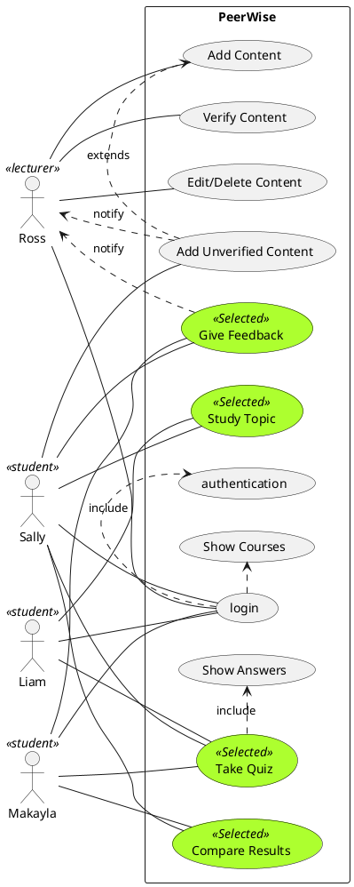

# SWEN303 Assignment 1: Learning Management System 
Daniel Pullon (300357323) 
Justina Koh (300441630) 
Weighting: Default - **Persona** - Use-cases - Reflection
# Part 1: Introduction
### Current Existing Solutions:
Currently, the University employs two major learning management systems: _Blackboard_ and the _ECS_ _wiki_. While both of these systems are used heavily by students and lecturers alike, they are able to serve their function of sharing powerpoints and other general course materials from lecturers to students - they are made to communicate basic information to a wide range of students. Listed below are the main issues that we have identified with the current existing systems: 

1. **Outdated**: the current systems are structured in a very ‘old-fashioned’ manner where one lecturer lectures a group of people. It would appear that the same mindset has been used when creating the old learning management systems, where they are designed to communicate basic information such as lab times, lecture slides etc. to all the students in the course. While this has appeared to work for the previous generations of students, the current modern day students have been raised with technology and a different mindset to the previous students. This means that lecturing ‘at’ people is no longer the best way to teach.
2. **Isolation**: the current systems do not encourage communication between the student and lecturer. 
3. **Boring**: as mentioned previously, the current Learning Management systems are no longer relevant to today’s students. This means that many students find them boring and uninteresting. 

Another system that we have identified is _Kahootz_. This is not officially used by the university, however many lecturers and students enjoy this app in lectures. While this is incredibly fun, and many students thoroughly enjoy using it, it is:
1. **Non-educational**: While quizzes can be made and can help test students’s knowledge, it doesn’t allow lecturers to upload notes for students. It’s sole function is to make quizzes for students. 
2. **Non-accessible**: The quizzes must be taken at the same time as everyone else, which means that students can’t use the quiz in their own time.

Our system creates a learning management system that will be easy and efficient to use, and most importantly provide support in learning and helping the students understand their papers by addressing the issues identified with the current systems. _(Please read the Business objectives section for more information)_.

### How our System will be designed: 
The system will have a very simple, minimalistic, yet colourful colour scheme. It will be designed so that anyone, with varying technological abilities, should be able to use the application / learning management system without much help or an instruction manual. This means that there will be clear icons to show the different options and tabs available.

Our learning management system should be able to carry out the following functions:
- The lecturers will be able to create some course content for the students to read, followed by a quiz to test their knowledge
- The students can also create quizzes for each topic which they can choose to share with the rest of the class if they wish 
- Students will be able to share their quiz results and compare their results with the rest of the class 
- Students can also give ‘feedback’ to the lecturer which the lecturer can use to help modify his course and create new quizzes to best suit the students’s need
- Different users will have different user functions
- Lecturers will have admin status meaning that they will be able to see everything and verify all content that is associated with their course (including student quizzes)
- Lecturers also have the ability to edit unverified quizzes 
- Students have the ability to give feedback to the lecturer 

### Stakeholder Information
Identified stakeholders:
- Lecturers	    High power/High interest
- Students      High power/High interest
- University    High power/low interest
 
| Lecturers | Students | University  |
|-----------------|:-------------|:---------------:|
| Is our system better than the current learning management system? | Is our system better than the current learning management system?|Is our system better than the current learning management system?
| Can false or incorrect content be made by other students / non students|Will incorrect information be created by users |Will the students and lecturers use this app|
|Will the app be easy and intuitive to use |Will the app be easy to use |Will it cause students to disengaged and not go to lecture|
|Will it cause students to disengaged and not go to lecture|              |                 |

#### Importance to Stakeholders:
When a student enrols in a course, the main reason is to help them develop a better understanding of that topic. However, a common short-term goal is for the student to pass their exams for that paper. The current outdated university system, where the students are ‘lectured-to’ by their lecturers, minimise the ability for each of the courses to be interactive and do not cater for the different learning types that the students may have. Currently, we live in a society that recognises the importance of difference and diversity. We now understand that there are an incredibly wide range of people, all with different learning abilities, and recognise that education should be accessible for everyone. The current learning management systems, as well the way papers are taught at university, is not made to ‘suit everyone’. 

Our app is designed to support all students in their quest for knowledge. It is not meant to be a replacement for the lectures, but much rather, helps students understand and develop their understanding for specific topics within a paper. 

### Business Objectives:
As mentioned above, we have identified three major issues with the current learning management systems. We believe that our app will address these issues and therefore it will make learning at university an incredibly fun, interesting and exciting experience. Which is why our app is so valuable. 

As students of the 21st century, we are becoming an increasingly diverse range of people. We now understand that there are an incredibly wide range of people, all with different learning abilities, and recognise that education should be accessible for everyone. The main issue with the current education system is that the way it is designed, it is only suited for a very specific, and minority group of people’s learning styles. Our learning system is designed to help students who may have different learning types to the one that we are used to teaching in schools. Our new, updated learning management system has been designed to help the course content be more accessible and understandable for the students. Therefore, it is obvious that our system’s main objectives is to create:

1. An easily navigable system that is intuitive to use
2. As a result, this app should support students to help pass their exams, and understand the course content better
3. Provide a system which the students can interact with each other as well as the teacher, and provide statistics to both the teacher and students in the class to understand how well the rest of the class is doing 
4. The app is designed to create a judge-free zone, allowing students to efficiently give feedback to the lecturersand increase the level constructive dialogue to lecturers
 
Justification for the main core functions
Our learning management system is supposed to be designed in such a way that is easy and accessible for everyone. While it is easy to assume that the large majority of students are used to technology and the basic, common layout for most apps, it is also important there are also a number of postgraduate, mature students as well as lecturers who may not necessarily be used to technology. Therefore it should be intuitive to use, even for people who aren’t used to technology. 

The learning management system is supposed to be a way to communicate the information to student(s) clearly, and concisely, removing all the excess, unneeded information. This is to cater to all students, especially those who are often confused by all the jargon that is used in lectures.

Many students are afraid to ask the lecturer questions during and after lectures or during office hours as they are afraid of being laughed at. This application will help reduce that anxiety for students as they can either directly ask the lecturer about the course without needing to see them face-to-face or post on the board where they aren’t physically confronted by the other students or lecturer.

# Part 2: Personas
Persona order of importance: Sally Robertson, Ross Gleeson, Makayla Ivanova, Liam Rolleston
* [Sally Robertson](https://gitlab.ecs.vuw.ac.nz/rahmanahad/swen303-project/-/blob/master/Resources/sally-robertson.pdf)
* [Ross Gleeson](https://gitlab.ecs.vuw.ac.nz/rahmanahad/swen303-project/-/blob/master/Resources/ross-gleeson.pdf)
* [Makayla Ivanova](https://gitlab.ecs.vuw.ac.nz/rahmanahad/swen303-project/-/blob/master/Resources/makayla.pdf)
* [Liam Rolleston](https://gitlab.ecs.vuw.ac.nz/rahmanahad/swen303-project/-/blob/master/Resources/liam-rollestion.pdf)

### Model Overview:  

Our model was designed to incorporate a wide range of people and ways to interact with Peerwise. The personas we made are designed to incorporate people with different priorities in their lives. Therefore in order to capture this we used Behavioural Variables. This allowed us to break the personas down into different categories of:
 
Activities - What they do  
Attitudes - How they think  
Aptitudes - Naturally good at  
Motivations - What they want  
Skills - Things they are good at  

We felt this was a good start but we also extended it to give each persona a background, discuss their weaknesses and their technical ability.

The three students we have are Sally, Liam and Makayla. We feel they incorporated most of the students that we interviewed. These personalities are people that are all passionate about separate things which means they will use Peerwise differently due to having different outlooks on study. We also included Ross who is a lecturer as a persona as they form an important part in the system, they are the administrators who have the final say on the direction of the content that is being taught, therefore it is crucial they remain involved as they will give the students the best information available.

Sally  
Her main priority is her studies. She will be the one that is the most important to us as she will engage with Peerwise everyday. The goal will be that she can use it to maintain her knowledge throughout the course.

Ross  
Ross’ primary aim is to give his students the best chance at success while also not being detrimental to the small amount of free time he has available. He will be the second most important as without him the content could quickly lose substance and direction.

Makayla  
Makayla’s is an important piece in the system as she fills in the section of students who at times are engaged with university but it is not their only priority. Makayla is someone who is active and requires a different form of learning than what the university traditionally provides. She can use Peerwise to stay engaged when she would otherwise be bored or to catch up when she gets behind.

Liam  
Liam is the least important for our personas. For most of the university year he will not be very engaged with his studies and will not be using Peerwise. Liam is an important piece during the final weeks when final projects or exams are coming up. During these times he will be using Peerwise more than anyone and may spend large periods of time attempting to catch up to the missed content. This means that during these times he will rely on Peerwise.

This shows how differently each persona uses the system. This helped to inform us of the different use cases of the system which is described in the diagram below: 

UML Use Cases

As you can see this outlines the different way the personas interact with Peerwise. It does not however show the specific differences as such things the difference in time spent when comparing Sally to Liam’s. Therefore we felt that is was important to have both scenarios in longer form and the essential use cases to further aid us in giving the full picture.

# Part 3: Usecases and Scenarios
* [Use cases](https://gitlab.ecs.vuw.ac.nz/kohjust/swen303-assignment-1/-/blob/master/SWEN303-Use-Cases.pdf)
### Scenarios
#### Scenario 1: Using the App everyday to supplement her learning  
*Persona involved:* Sally Robertson  
*Description:* 
- After each lecture girl goes home and immediately uses the app to help her review what she’s learnt that lecture
- She will then make her notes by incorporating the information she’s learnt through the app and the notes she took in the lecture
- After making lecture notes, she will make flashcards with the app for that lecture by adding to the corresponding topic
- She then goes over the course material that she’s previously learnt by going through her own flashcards 
- Will message the lecturer anything she is unsure about - however this is not common. She usually understands most of the topic, but she will send the lecturer feedback about each topic 
- Before the exam she uses the app again to review all the content again through the use of flashcards 
- She will then make some more flashcards that encapsulates the most important points of each subject 

#### Scenario 2: Helping to study for exams  
*Persona involved:* Makayla Ivanova 
*Description:*
- Near exams she will meet up with her friends and go through the content together
- After they do the pre-reading, she and her friends will go through the quizzes testing each other and explaining to each other what they’re confused about
- If they are all stuck on something they will message the lecturer 
- She and her friends will then create quizzes for things that they got the most incorrect answers for / unsure about

#### Scenario 3: Uploading for students  
*Persona involved:* Ross Gleeson
*Description:*
- After every subtopic he will upload his course content before he puts up his quiz for that topic
- He then reads the quizzes uploaded by the students to approve whether it is the correct content and deletes / edits anything that he thinks is incorrect
- He will then check his inbox to see what the students have sent him
- He will then look at the marks people have received for the quiz and will develop a new lecture plan based on 
- He will also use it to create quizzes and the lecture content 
- Will reply messages on the app / on the class anonymous question board 
- Before exam time, he will make more quizzes for the students to take. At this time, he will get the results and use this to help them create a lecture focusing on what they’re most struggling with

#### Scenario 4: Last minute cramming session  
*Persona involved:* Liam Rolleston
*Description:*
- Doesn’t do any of the lectures, only does the bare minimum for assignments
- Will know the basic minimum about the subject to make sure he gets enough points for each assignment 
- The night before the exam, he will access our LMS and go through all topics 
- He will read the pre-reading for each subject - jot down the most important points and then do the associated quizzes afterwards
- Afterwards he will do one or two practice exams if he has the time, and will use the app and the notes to help him if he doesn’t know the answer
- Does not send the lecturers any feedback and / or question

# Part 4: Reflection
### Justina's reflection:
#### Persona Reflection
The creation of the persona was an interesting experience. It’s something that we’ve never had to do before as software engineers as we’re usually given very direct and strict instructions as to what we’re creating - we don’t usually consider the importance of the user experience. 

The process that we went through in order to generate the personas was a rather convoluted one. 
1. *Used gender mag persona generation technique*

This was used to generate the first two polar oppposite male and female personas. 

2. *Completed the persona profiles using gender mag*

We found this incredibly useful, however as we needed four personas rather than the three gender mag usually only has, we found that the middle persona ‘Pat’ actually was holding us back. We found that it was incredibly difficult to cover the base ground and have different personas with different use cases, but not so different they’d be like the extreme personas, and not so similar that they would have the same habits and personality as the extreme cases.

3. *Drew a line with each persona on either side and plotted three evenly spaced dots along the middle*

As we are both visual learners, and think better when we can physically see and draw something, we decided to stop using the gender mag technique and visualise the personas through a timeline. 

We found that this didn’t work and we really struggled to create personas that weren’t so different that they were the extreme personas, but also not so similar that they had the same personalities. 

4. *Interviewed friends from university*

In order to help us with this issue we had in the previous step, we interviewed a variety of our friends from the software engineering courses. While this proved to be an incredibly interesting experience, it wasn’t particularly helpful for us - in fact it made us more confused as all of our friends had the same views and approaches to studying and they all had similar studying and course experiences. From this, we realised that we had very little ‘course diversity’ in the people that we interviewed, and therefore all of our feedback showed us that there was only one way people would use our potential app. Most of our friends identified with users that were in the middle of the spectrum we drew, and it confused the two of us particularly as we already struggling to make personas for the people in the middle.
  
However, this lead us to realise that it would be likely that for each paper / course / degree, there would be a general need for something. For the engineering and computer science students, it was the need to type, present and ask questions about code, and this led us to develop the idea of a coding quiz for the engineering and computer science students. 

We also found that the way / method that we were interviewing the different people was also greatly flawed. While the response from our friends was very positive and they did the interview with great vigour, we found that we really struggled to cut down the number of ideas down and resulted in pages of ideas and information about learning and how each person learnt. 
Interestingly, this hindered our thought process of developing each persona as it overloaded us with extra, unneeded information. We later ended up refining the process by limiting the interview to three questions instead of letting the students talk freely. This proved to be more effective as the questions that we needed to be answered the most urgently would be, and if we felt that more information was needed, we were able to make that call and ask for more information depending on the case. 

5. *Brainstormed*

While brainstorms previously worked very well for the both of us on other projects, we discovered that the use of brainstorms in this case was not particularly helpful due to the free nature of the assignment. Unlike other assignments, where the guidelines were much more rigid, this assignment had a degree of freedom that we were not used to. This resulted in a rather interesting outcome for us when using mindmaps to plan the personas, and the application functions. Much like with interviewing the students, we found that we got too carried away about possible ideas, and in the end the mindmap became something more like a mind-dump, and it was more confusing and not helpful at all

6. *Mind-mapped*

This worked particularly well for us as we were able to bounce ideas off each other, and we were able to write down the ideas that we had and physically narrow down the possibilities of personalities as we crossed out ideas and came up with more. Here we were able to realise that we were using the wrong technique the whole time, and that generating the personas through behavioural variables would be more suitable. This is as our app is based on people's study behaviour, which is not determined by their gender. We then edited our original personas to fit this generation technique better. 

7. *Interviewed more friends*

This was an incredibly helpful last step for us to refine the personalities. It was especially effective as we’d learnt from the first interview some important interviewing techniques and that we needed to interview a wider variety of students. 

*Summary*

The development of the personas was very interesting particularly as Software Engineering students. The both of us found that we’d never encountered a situation like this before, where we were required to ‘become’ the user themselves - and we found this highly enjoyable despite struggling to come up with the possible personas. It also made us more aware of how we need to be aware about other users who may not be as technologically-savvy as us, especially as we are constantly surrounded by technology and people who are proficient in this. After interviewing a bigger variety of our student friends, we quickly realised that our original design for the app was too finicky and customisable for most students who were not doing computer science. They didn’t care that you could go and fiddle around with the 'behind-the-scenes' code, and so that feature was soon removed from our app. 

If I were to do this project again, I would use the same sort of process again, particularly the interviewing and the gender mag technique. Personally, I found that the gender mag technique was incredibly helpful for us to start the personas off, as it was able to cover the extremities through the stereotypical male and female, polar opposite stereotypes and made sure that we would account for the variety of people. As mentioned previously, the interviewing helped us confirm the personas that we had, however we also learnt from this experience how incredibly important it is to have diversity in the people you interview. 

#### Scenario Reflection:
Personally, creating the scenarios was much easier than creating the personas. Incredibly, we found that after creating the personas and solidifying exactly what we wanted the app to do, it was a very natural flow to create the scenarios. It was a very ordered and sequential process where we pretended to be each of the characters and acted as if we were that persona using our app. 

The most interesting aspect of this process was that as I’d never done something like this before, trying to fully become that persona and not holding onto my own habits and personality was a little bit challenging. Although it may be obvious in hindsight, I hadn’t realised that I had so many little quirks and habits which I thought were normal, but other people might not have, and it wasn’t until my partner pointed out that everyone might not do things the same way as me, did I realise that. It also led me to realise how everyone has habits and specific ways to do things, and creating to cater for all those habits and preferences is incredibly hard. Even when my partner and I were discussing what we wanted the app to be able to do, we disagreed on many things as we have different study habits and personalities. For us, this was enough to create the use cases and scenarios. 

We also tried to do some textual analysis with some transcripts of what some interviewees had said, however it was an incredibly difficult and long process which we later discovered did not help us at all. While I understand how it could have the potential to help in other cases, the textual analysis didn’t help us as it took an astoundingly long time to do, and when we finished we ended up with information we already knew.

I found that I strongly preferred writing the short use-cases to the longer bullet-point scenarios as they were definite and succinct in what exactly was being carried out, and by whom. 

_Summary_ _of_ _everything_
This experience allowed me to understand and see something from another person’s perspective and it made me realise how differently everyone thinks. While this may be obvious, I full realised _how_ much differently everyone’s thought process was and through creating the pesonas, interviewing different people and writing their scenarios did I realised this. 

### Daniel’s Reflection:
#### Persona Reflection:
Creating the personas was the most interesting part of the assignment for me. During the process of creating our personas we found that our 3 student personalities gave us some clear personalities that were separate from one another and covered a large range of people. We had also planned out a fourth student persona but we decided to not include him in the end as he overlapped with the other personas too much, he did not have a unique identity of his own and was instead pieces of the others. This gave us confidence that we had done a good job of covering personas.

We started by brainstorming some ideas for the types of people we have seen during our time in university. In the beginning we used Gender Mag to help us create what felt like hollow stereotypes. 
These stereotypes were good to help us think about the extreme cases and useful for scenarios. To create these stereotypes we brainstormed personality traits for each person. Sally and Liam began as these cliches, Sally was the studious type who was very robotic and the ‘ideal student’, the words we used to describe her included studious, focussed, determined. Liam was the direct opposite of this in many ways, he was someone that had everything handed to him, he didn’t do any university work because he was lazy and relied on his father, so we used words to describe him like lazy, procrastinator and arrogant. We then slotted in 2 other personalities somewhere along this line of how hard they studied. 
The problem was that they didn’t feel like real people, this was apparent when we asked people to see who they related to in our example, we got very lukewarm responses as people felt it was hard to relate to such hollow personas. We then went and made revisions. We thought about the problem differently. Instead of putting them on a straight line of ‘studious’ to ‘disengaged’, we had to think about what were their motivations for study. This led to us to incorporate the Behavioural Variables. Once we did that we could focus on the positive aspects in these personas and realise that if university wasn’t a main priority it was because they had others, like sports and work. When we returned to our friends and asked them to relate, it became easier and a more enjoyable experience as the personas had goals but also quirks and faults just like people (compared being the terminator and the dude).

#### Scenario Reflection:
The scenarios were greatly helped by our thorough process during our creation of the personas. We created our scenarios by using our fleshed out personas to build what a day to day life would be like for them. It made it much easier when they all had hobbies and activities they enjoyed doing. Because people could also now relate to these people it allowed us to simply ask our friends about what kind of scenarios they would use Peerwise.

I personally found creating the scenarios and especially the use cases to be not as enjoyable as the personas. It felt that there was a flow to this assignment where once the personas had been set and defined everything else fell into place after that. It was satisfying to have a natural flow on from the previous work we completed and I think that showed we made strong personas, but it also made the rest of the assignment feel as though we were filling in the blanks. I also personally dislike UML and if I was to do this assignment again, I would attempt to use another diagram to describe our system, maybe one that could better describe time.

So I think the lesson for me is that when trying to think about how somebody else will use a system it is crucial that you gain as much information on that person’s behaviour and personality. Because once you know those aspects, it should make it much clearer how they are going to use it. This is something that most of us know and understand to an extent but doing this assignment it helped to clarify that for me as well as refine the impact it has. Another plus was seeing it in a ‘formal’ document that had an outline to follow for the discussion as it helped to give structure and better show the relationship between the different sections.

